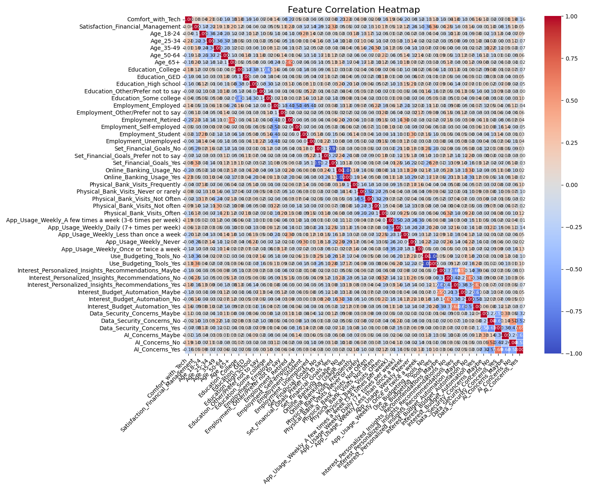
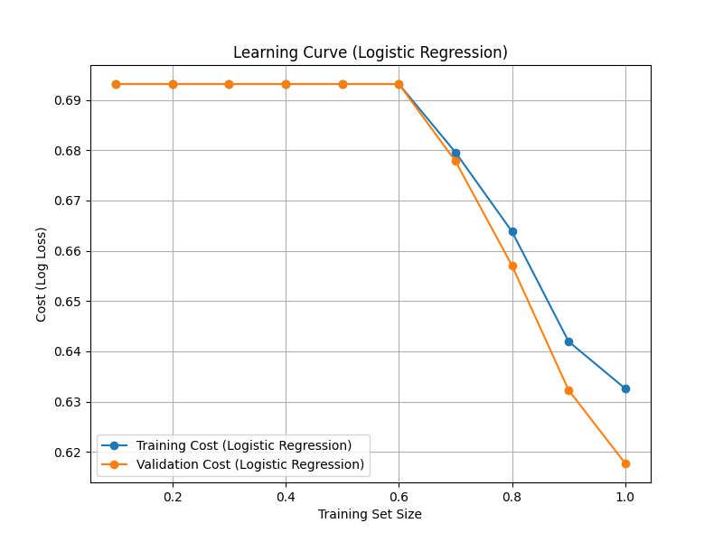
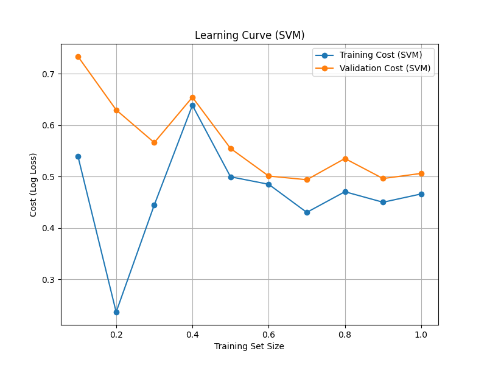
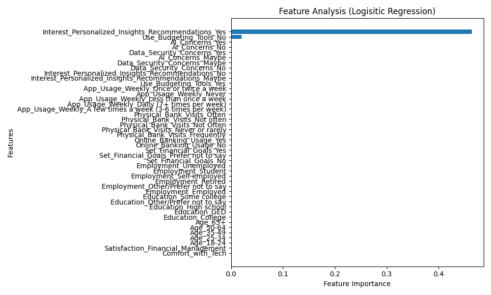
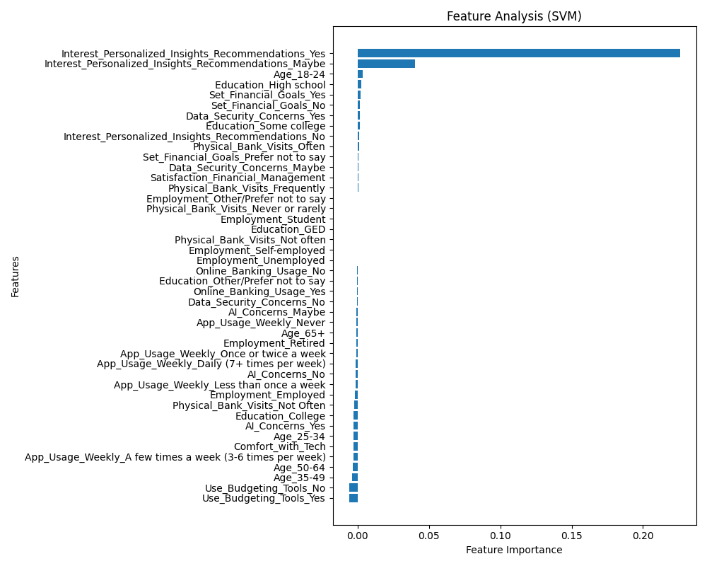
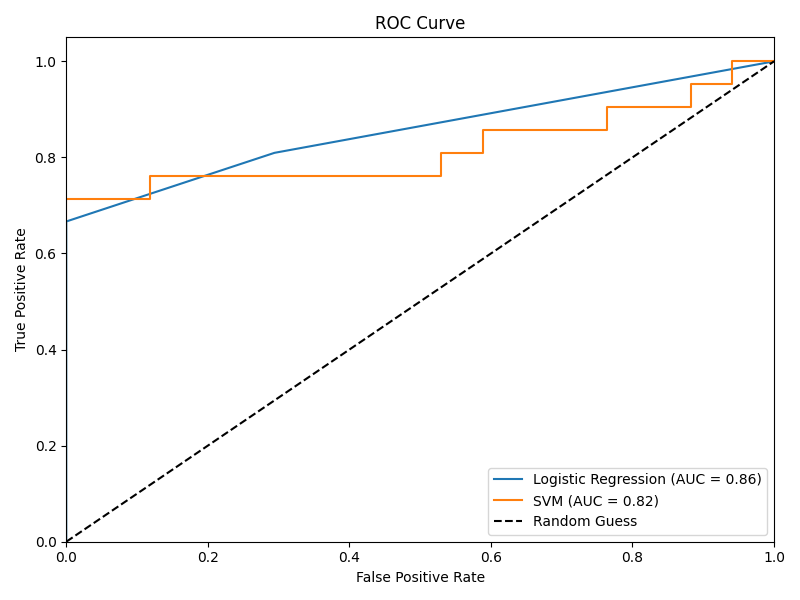
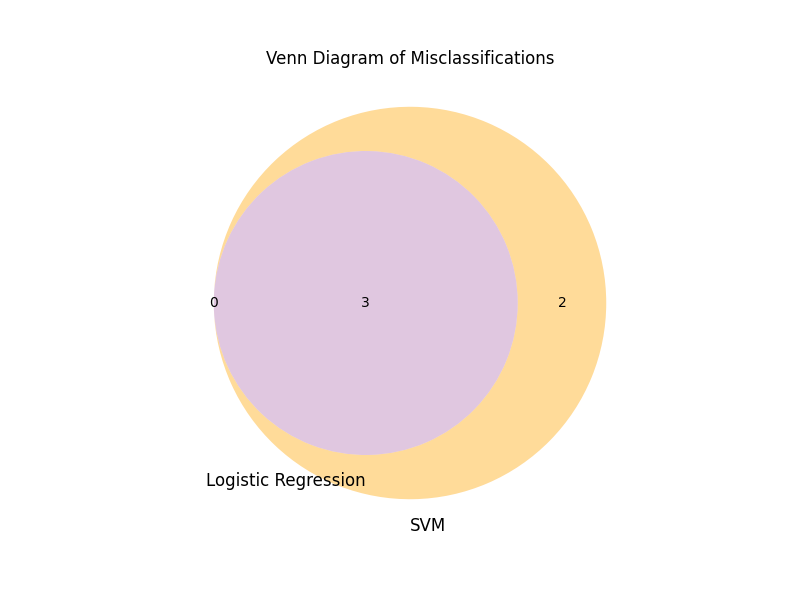

# Financial Tool Adoption Prediction Model

This project predicts whether consumers are likely to adopt **AI-based financial products** such as **budget automation tools**, using survey data collected via Google Forms.  
The goal is to understand how demographic factors, financial behavior, and comfort with technology influence adoption likelihood.

---

## 🎯 Objectives

- Predict consumer interest in **AI-powered budgeting tools**.  
- Identify key factors that influence adoption.  
- Compare performance between **Logistic Regression** and **Support Vector Machine (SVM)** classifiers.  
- Use **GridSearchCV** to optimize model hyperparameters for better generalization.

---

## 📊 Dataset Description

The dataset was collected via a custom Google Forms survey. It contains demographic information, financial behavior, technology comfort levels, and interest in financial AI products.

### Features

- **Demographics**
  - `Age`, `Education`, `Employment`
- **Financial Behavior**
  - `Set_Financial_Goals`, `Online_Banking_Usage`, `Physical_Bank_Visits`, `App_Usage_Weekly`, `Use_Budgeting_Tools`  
  - `Satisfaction_Financial_Management` (Likert scale 1–5)  
- **Technology & AI Attitudes**
  - `Comfort_with_Tech` (Likert scale 1–5), `Data_Security_Concerns`, `AI_Concerns`  
- **Interest Variables**
  - `Interest_AI_Financial_Management` (removed from modeling to avoid leakage)  
  - `Interest_Personalized_Insights_Recommendations`  
  - `Interest_Budget_Automation` (Yes/No/Maybe → one-hot encoded target variable)  

### Dataset Size
- 192 responses  
- Balanced class distributions across train/validation/test sets.

---

## ⚙️ Methods

1. **Preprocessing**
   - One-hot encoding for categorical variables (kept as 0/1).  
   - **Selective scaling** applied *only* to continuous features:  
     - `Comfort_with_Tech`  
     - `Satisfaction_Financial_Management`  
   - Correlation heatmap used to check multicollinearity.  

2. **Models**
   - Logistic Regression with L1/L2 regularization  
   - Support Vector Machine (SVM) with linear and RBF kernels  

3. **Hyperparameter Tuning**
   - Used **GridSearchCV** with 5-fold stratified CV.  
   - Logistic Regression: varied `C` (0.001 → 100) and penalties (`l1`, `l2`).  
   - SVM: tested kernels (`linear`, `rbf`), `C` (0.1 → 100), and `gamma`.  

4. **Evaluation**
   - Accuracy, Precision, Recall, F1-Score  
   - ROC Curves & AUC  
   - Learning Curves  
   - Misclassification Venn Diagrams  
   - Feature Importance Analysis  

---

## 🧪 Results (Test Set)

With tuned hyperparameters:

| Model                | Best Params                          | Accuracy | Precision (False/True) | Recall (False/True) | F1 (False/True) |
|----------------------|--------------------------------------|----------|-------------------------|----------------------|-----------------|
| Logistic Regression  | `{'C': 0.1, 'penalty': 'l1'}`       | **0.92** | 0.86 / **1.00**        | **1.00** / 0.86     | 0.92 / 0.92     |
| SVM (Linear Kernel)  | `{'C': 0.1, 'gamma': 'scale'}`      | 0.87     | 0.84 / 0.90            | 0.89 / 0.86         | 0.86 / 0.88     |

**Key Changes After GridSearchCV**
- Logistic Regression improved with **L1 penalty (feature selection) and C=0.1 (moderate regularization)**.  
- SVM performed best with a **linear kernel** (RBF was unnecessary because data is mostly linear after one-hot encoding).  
- Logistic Regression achieved the **best overall accuracy (92%)**.  

---

## 📊 Analysis & Visualizations

### 1. Correlation Heatmap
Checks multicollinearity among features.  



---

### 2. Learning Curves

- **Logistic Regression**: smooth convergence, training and validation costs decrease together.  
- **Note**: In this case, **training cost is slightly higher than validation cost**.  
  - This happens because **L1 regularization (C=0.1)** constrains the model on noisy training data, but the validation split was slightly “cleaner” and easier to fit.  
  - It’s a positive sign that the model generalizes well and avoids overfitting.  

- **SVM**: validation cost stabilizes around 0.5, though training cost fluctuates due to small sample size.  

  
  

---

### 3. Feature Importance

- Logistic Regression (L1) zeroed out most features, focusing only on:  
  - `Interest_Personalized_Insights_Recommendations_Yes`  
  - `Use_Budgeting_Tools_No`  
- SVM (linear) highlighted similar drivers but spread weight slightly more broadly.  

  
  

---

### 4. ROC Curves

- Logistic Regression AUC = **0.86**  
- SVM AUC = **0.82**  



---

### 5. Misclassifications

- Logistic Regression misclassified **3 cases**.  
- SVM misclassified **5 cases**, with 3 overlapping errors.  



---

## 📚 Lessons Learned

### ⚖️ Selective Scaling
- Scaling all features (including one-hot dummies) reduced performance.  
- Scaling only continuous variables improved results, especially for Logistic Regression.  

### 🔍 Effect of Regularization
- **L1 regularization (LogReg)** shrank unhelpful features to zero, improving generalization on a small dataset.  
- **C=0.1** provided the right balance between bias and variance.  

### 🔎 Why SVM Chose Linear
- With one-hot encoded data, the problem is already high-dimensional and nearly linearly separable.  
- Linear kernel outperformed RBF, showing the boundary didn’t require complex curvature.  

### 📈 Training Cost > Validation Cost
- Occurs when:  
  - Regularization penalizes noisy training data more strongly.  
  - Validation set happens to be slightly easier.  
- It’s a **sign of healthy generalization**, not a red flag.  

### 🧮 Polynomial Features
- Adding polynomial features increased dimensionality and worsened performance (overfitting small dataset).  
- RBF-SVM already captures non-linearities, so polynomials were unnecessary.  

### 🧐 Overfitting Risk Assessment
- Validation (82%) and test performance (92% LogReg, 87% SVM) are consistent, showing no large gap.  
- Learning curves converge, suggesting the models are not memorizing noise.  
- L1 regularization actively reduced overfitting by eliminating weak features.  
- ⚠️ However, the dataset is small (~190 samples). Results may vary with different splits.  
- Future work: apply **cross-validation on the full dataset** and collect more responses for stronger confidence.  

---

## 📂 Project Structure

```
Financial Tool Adoption Model/
│
├── Code/                         
│   ├── predict_interest.py       # Main driver script (GridSearchCV + analysis)
│   ├── corr_heatmap.py           # Correlation heatmap
│   ├── feat_analysis_log_reg.py # Feature analysis (log reg)
│   ├── feat_analysis_svm.py     # Feature analysis (SVM)
│   ├── learning_curves.py       # Learning curves
│   ├── misclassifications.py    # Misclassification plots
│   └── roc_curves.py            # ROC curves
│
├── Data/
│   └── pop_sample.csv            # Survey data
│
├── Visuals/                      # Saved plots
│
└── README.md                     # Documentation
```

---

## 🚀 How to Run

### 1. Clone this repository
```bash
git clone https://github.com/yourusername/financial-tool-adoption-model.git
cd financial-tool-adoption-model
```

### 2. Create a virtual environment
```bash
python3 -m venv venv
source venv/bin/activate
```

### 3. Install dependencies
```bash
pip install pandas numpy scikit-learn matplotlib seaborn matplotlib-venn
```

### 4. Run the model
```bash
python Code/predict_interest.py
```

---

## 📌 Key Insights

- Consumers comfortable with technology and already using budgeting tools are most likely to adopt **AI-driven budgeting automation**.  
- Logistic Regression with **L1 penalty, C=0.1** gave the best predictive performance (**92% accuracy**).  
- SVM with a **linear kernel** performed well but slightly worse (**87% accuracy**).  
- Learning curves and ROC confirmed robust generalization.  

---

## 🧠 Future Work

- Collect a larger and more diverse dataset.  
- Expand prediction to full multiclass (Yes / No / Maybe).  
- Deploy as an interactive dashboard or web app.  

---

## 📜 License

This project is open-source and available under the [MIT License](LICENSE).
